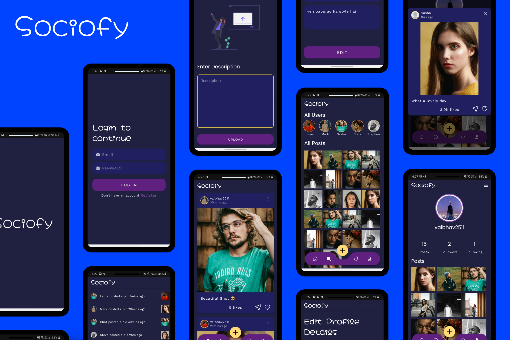
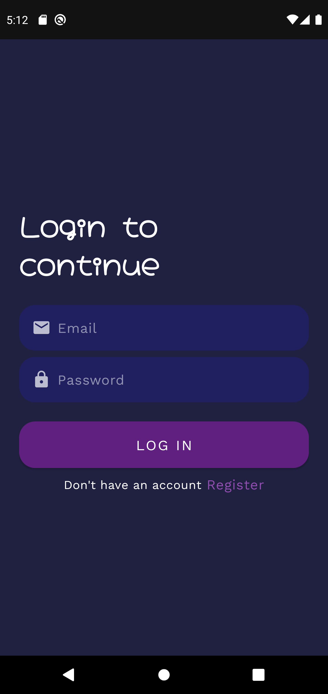
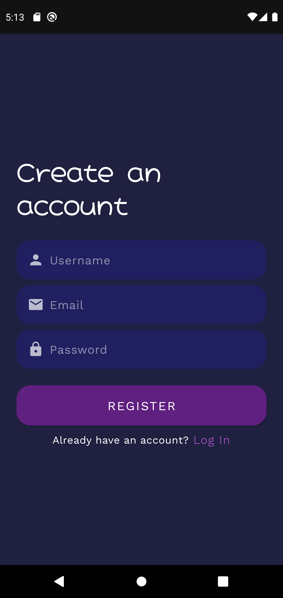
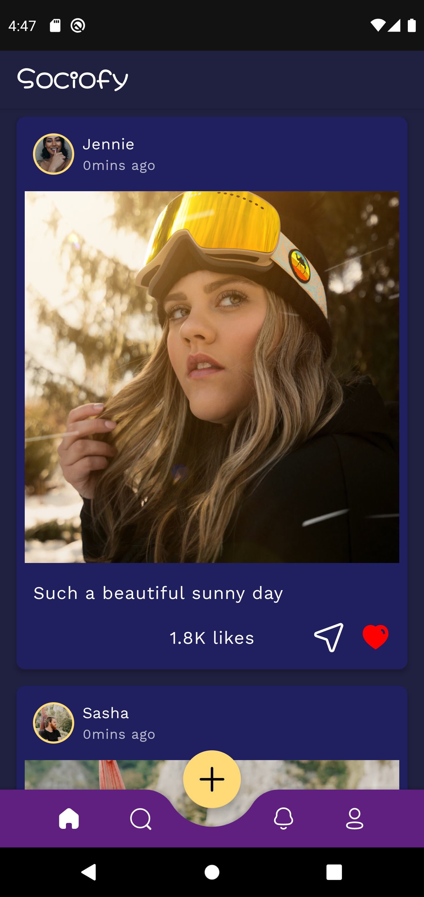
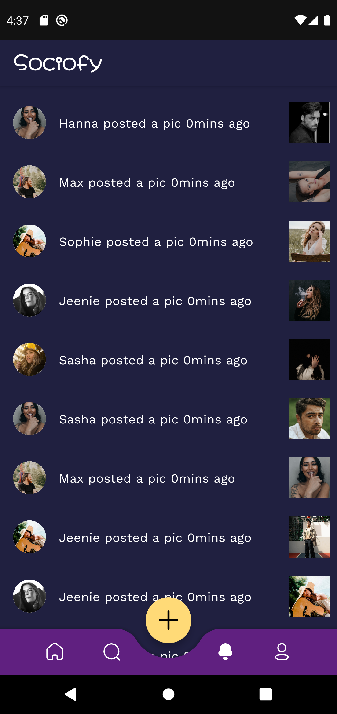
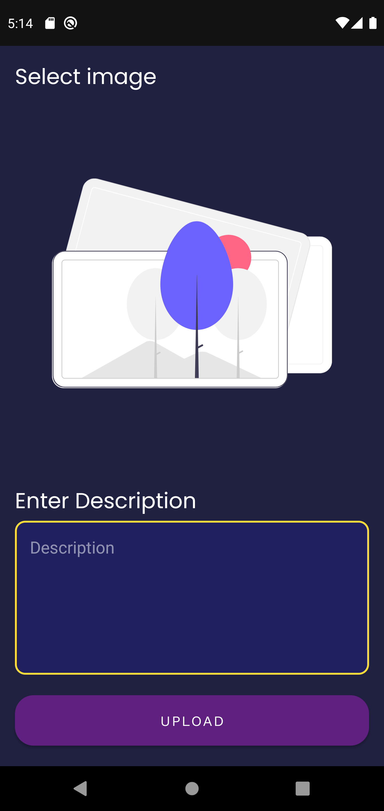

# **Sociofy** 

**Sociofy** is a social media Android application 📱 built to demonstrate use of *Modern Android development* tools.

## **Under Development**🛠

## Setup
Clone the repository on your machine. Open the project on your IDE and connect it to firebase and everything will be setup

## About

 It uses firebase as its backend. It uses Firestore which is a NoSQL database to store all data. Firebase Storage to store images and Firebase Auth for the authentication

- Fully functionable. 
- Clean and Simple Material UI.
- It supports dark theme too 🌗.

## 📸 Screenshots

||||
|:----------------------------------------:|:-----------------------------------------:|:-----------------------------------------: |
|  |  |  |
|  |  |  |
|  |  |  |

## Built With 🛠
- [Kotlin](https://kotlinlang.org/) - First class and official programming language for Android development.
- [Coroutines](https://kotlinlang.org/docs/reference/coroutines-overview.html) - For asynchronous and more..
- [Flow](https://kotlin.github.io/kotlinx.coroutines/kotlinx-coroutines-core/kotlinx.coroutines.flow/-flow/) - A cold asynchronous data stream that sequentially emits values and completes normally or with an exception.
- [Android Architecture Components](https://developer.android.com/topic/libraries/architecture) - Collection of libraries that help you design robust, testable, and maintainable apps.
  - [LiveData](https://developer.android.com/topic/libraries/architecture/livedata) - Data objects that notify views when the underlying database changes.
  - [ViewModel](https://developer.android.com/topic/libraries/architecture/viewmodel) - Stores UI-related data that isn't destroyed on UI changes. 
  - [ViewBinding](https://developer.android.com/topic/libraries/view-binding) - Generates a binding class for each XML layout file present in that module and allows you to more easily write code that interacts with views.
  - [DataBinding](https://developer.android.com/topic/libraries/data-binding) - Binds data directly into XML layouts
- [Dependency Injection](https://developer.android.com/training/dependency-injection) - 
  - [Hilt-Dagger](https://dagger.dev/hilt/) - Standard library to incorporate Dagger dependency injection into an Android application.
  - [Hilt-ViewModel](https://developer.android.com/training/dependency-injection/hilt-jetpack) - DI for injecting `ViewModel`.
- [Backend](https://firebase.google.com) - Google Firebase
  - Firebase Auth - To support email based authentication
  - Firebase Firestore - A NoSQL database to store all data 
  - Firebase Storage - A clous storage to store all images
- [Retrofit](https://square.github.io/retrofit/) - A type-safe HTTP client for Android and Java.
- [GSON](https://github.com/google/gson) - A modern JSON library for Kotlin and Java.
- [Timber](https://github.com/JakeWharton/timber) - A simple logging library for android.
- [GSON Converter](https://github.com/square/retrofit/tree/master/retrofit-converters/gson) - A Converter which uses Moshi for serialization to and from JSON.
- [Glide](https://github.com/bumptech/glide) - An image loading library for Android backed by Kotlin Coroutines.
- [Material Components for Android](https://github.com/material-components/material-components-android) - Modular and customizable Material Design UI components for Android.

# Package Structure
    
    com.vaibhav.sociofy    # Root Package
    .
    ├── data                # For data handling.
    │   ├── model           # Model data classes 
    │   └── repository      # Single source of data.
    |
    ├── di                  # Dependency Injection             
    │   └── module          # DI Modules
    |
    ├── ui                  # UI/View layer
    │   ├── authorization   # Authorization Activity and its fragments
    │   ├── homescreen      # Home Activity and its fragments
    |   ├── profilescreen   # profile Activity and its fragments
    |   ├── splashscreen    # Splash Activity
    │   └── uploadscreen    # Upload Activity
    |
    └── utils               # Utility Classes / Kotlin extensions

## Architecture
This app uses [***MVVM (Model View View-Model)***](https://developer.android.com/jetpack/docs/guide#recommended-app-arch) architecture.

  
 ## Contact
If you need any help, you can connect with me.

Visit:- [VaibhavJaiswal.io](https://vaibhav2002.github.io)
  

